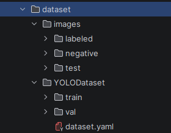
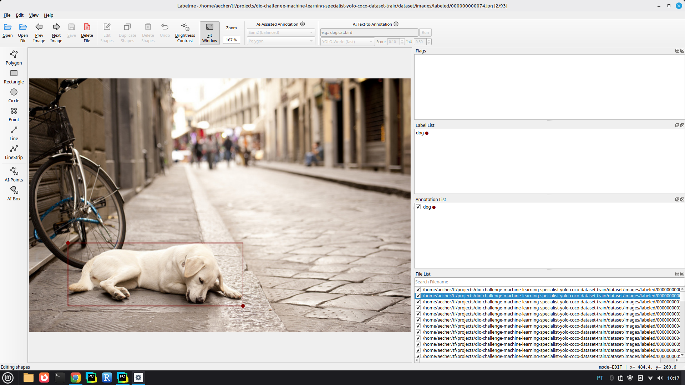
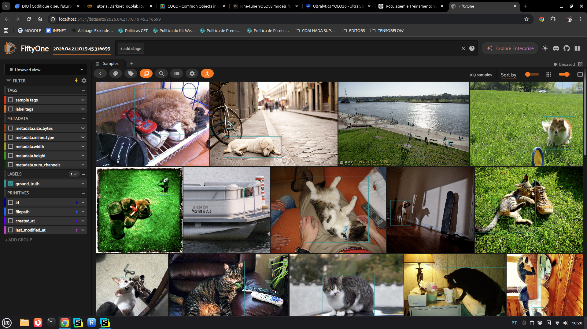
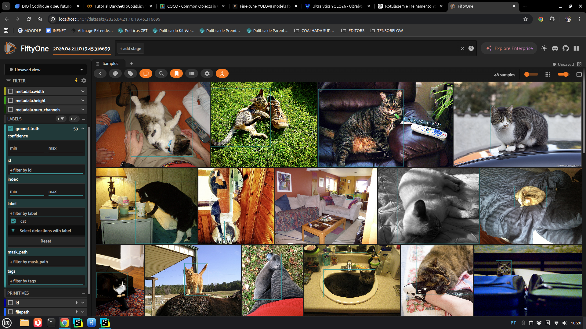
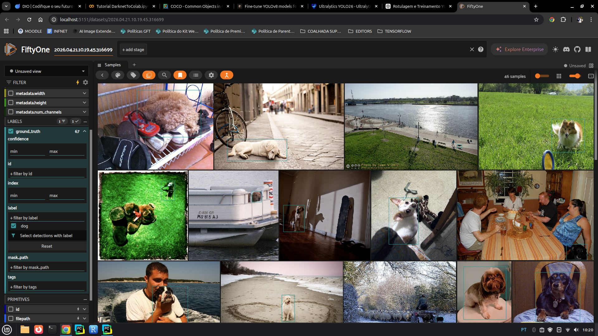
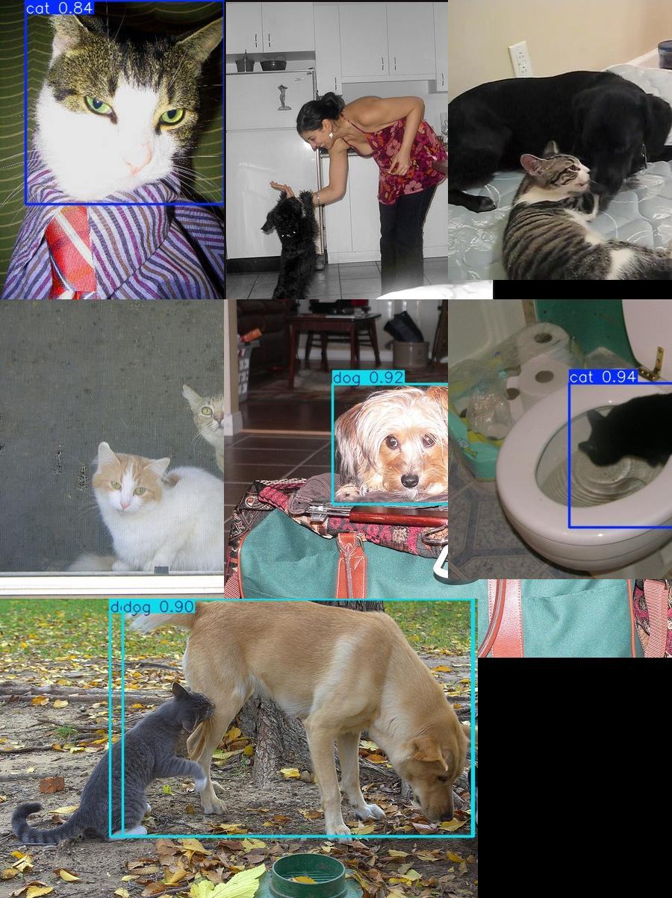
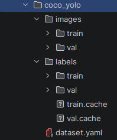
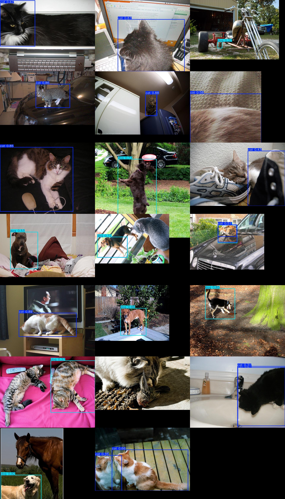
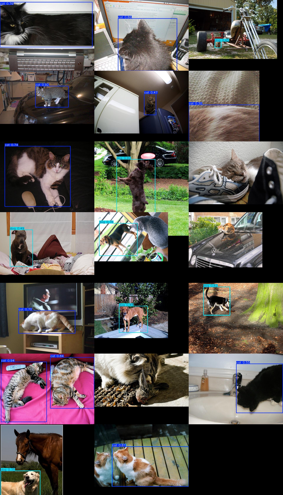

# Desafio: Criação de Uma Base de Dados e Treinamento da Rede YOLO

Foi inicialmente criada uma base de dados própria contendo imagens de gatos e cachorros, que foram rotuladas manualmente utilizando o LabelMe e posteriormente convertidas para o formato YOLO. Em seguida, foi realizado o treinamento de um modelo YOLO com essas duas classes, aplicando transfer learning a partir de pesos pré-treinados. Devido às limitações do dataset manual (pequena quantidade e menor diversidade), os resultados foram parcialmente satisfatórios, o que motivou a utilização do dataset COCO, já previamente rotulado, permitindo ampliar significativamente a quantidade de dados de treino e validação. Com isso, foram realizados novos treinamentos e ajustes de parâmetros, incluindo a calibração do limiar de confiança, resultando em melhor desempenho na detecção das classes “cat” e “dog”. Durante o processo, foi possível observar o impacto do volume de dados e dos hiperparâmetros na qualidade do modelo, evidenciando a importância do balanceamento entre precisão e recall para otimizar a assertividade das detecções.

# Primeira abordagem criar um dataset de imagens e rotular manualmente

Para esta etapa foram copiadas manualmente algumas imagens de `gato` e `cachorro` obtidas do dataset coco-2017 para a pasta `dataset/images/labeled`, depois foram rotuladas utilizando o `labelme` GUI do python, apos a rotulação foram convertidas em formato `Yolo` utilizando o `labelme2yolo`.

Estrutura da pasta: 
- `labeled`: contem as imagens rotuladas manualmente (53 gatos / 67 cachorros)
- `negative`: contém imagens não rotuladas pois não possuem gatos nem cachorros
- `test`: contém imagens utilizadas para testar o reconhecimento de gatos e cachorro do modelo



Aqui temos um exemplo de como a rotulação foi feita:


Aqui temos todas as imagens rotuladas no fiftyone:






O código utilizado para treinamento foi o seguinte:

``` python

# =========================
# 1. IMPORTS
# =========================
from ultralytics import YOLO

# =========================
# 2. CARREGAR MODELO
# =========================
model = YOLO("yolo26n.pt")  # modelo leve ideal pro seu dataset

# =========================
# 3. TREINAMENTO
# =========================
model.train(
    data="dataset/YOLODataset/dataset.yaml",
    epochs=150,
    imgsz=640,
    batch=16,
    device=0,
)

# =========================
# 4. VALIDAÇÃO
# =========================
metrics = model.val()

print("\n===== MÉTRICAS =====")
print(metrics)

# =========================
# 5. PREDIÇÃO (TESTE)
# =========================
model.predict(
    source="dataset/images/test",
    save=True,
)

```

O treino foi realizado na maquina local utilizando a GPU abaixo:

``` shell

(tf) aecher@aecher-RYZEN:~/tf$ nvidia-smi
Tue Apr 21 10:34:17 2026       
+-----------------------------------------------------------------------------------------+
| NVIDIA-SMI 590.48.01              Driver Version: 590.48.01      CUDA Version: 13.1     |
+-----------------------------------------+------------------------+----------------------+
| GPU  Name                 Persistence-M | Bus-Id          Disp.A | Volatile Uncorr. ECC |
| Fan  Temp   Perf          Pwr:Usage/Cap |           Memory-Usage | GPU-Util  Compute M. |
|                                         |                        |               MIG M. |
|=========================================+========================+======================|
|   0  NVIDIA GeForce RTX 5060        Off |   00000000:07:00.0  On |                  N/A |
|  0%   39C    P5             11W /  145W |     394MiB /   8151MiB |     15%      Default |
|                                         |                        |                  N/A |
+-----------------------------------------+------------------------+----------------------+

```

O resultado do treino não foi muito satisfatório pois o dataset era pequeno para conseguir obter conhecimento assertivo, mas conseguiu fazer algumas identificações, algumas não identificou nada, algumas identificou um objeto o outro não:



# Segunda abordagem utilizar mais dados já rotulados do COCO-2017

Aqui nesta etapa utilizei uma quantidade maior de dados no treinamento, os dados foram obtidos do dataset coco-2017, o resultado foi um pouco mais satisfatório pois melhorou os resultados principalmente em imagens que tinham mais de um objeto e gatos e cachorros juntos, ainda manteve alguns erros, algumas não foram identificadas, algumas foram identificadas errada.

A estrutura ficou assim:



O código obtem 600 imagens de gatos e cachorros para treino e 200 imagens para validação do dataset coco-2017 assim como as suas labels, depois gera o mapa `dataset.yaml` para ser utilizado no modelo, treina e aplica o modelo nas imagens de validação.

``` python
# =========================
# 1. IMPORTS
# =========================
import fiftyone as fo
from ultralytics import YOLO

# =========================
# 2. BAIXAR COCO (cat + dog)
# =========================
classes = ["cat", "dog"]

dataset_train = fo.zoo.load_zoo_dataset(
    "coco-2017",
    split="train",
    label_types=["detections"],
    classes=classes,
    max_samples=600
)

dataset_val = fo.zoo.load_zoo_dataset(
    "coco-2017",
    split="validation",
    label_types=["detections"],
    classes=classes,
    max_samples=200
)

print("Train:", len(dataset_train))
print("Val:", len(dataset_val))

# =========================
# 3. EXPORTAR PARA YOLO (CORRIGIDO)
# =========================

classes = ["cat", "dog"]

dataset_train.export(
    export_dir="coco_yolo",
    dataset_type=fo.types.YOLOv5Dataset,
    label_field="ground_truth",
    split="train",
    classes=classes
)

dataset_val.export(
    export_dir="coco_yolo",
    dataset_type=fo.types.YOLOv5Dataset,
    label_field="ground_truth",
    split="val",
    classes=classes
)


# =========================
# 4. CRIAR dataset.yaml
# =========================
yaml_content = """
path: coco_yolo

train: images/train
val: images/val

names:
  0: cat
  1: dog
"""

with open("coco_yolo/dataset.yaml", "w") as f:
    f.write(yaml_content)

print("dataset.yaml criado")


# =========================
# 5. TREINAMENTO YOLO
# =========================
model = YOLO("yolo26n.pt")

model.train(
    data="coco_yolo/dataset.yaml",
    epochs=150,
    imgsz=640,
    batch=16,
    device=0,
    patience=10
)


# =========================
# 6. VALIDAÇÃO
# =========================
metrics = model.val()

print("\n===== MÉTRICAS =====")
print(metrics)


# =========================
# 7. PREDIÇÃO (TESTE)
# =========================
model.predict(
    source="coco_yolo/images/val",
    save=True,
    conf=0.25
)
```

Resultado obtido:



Pude perceber que quanto mais imagens temos no treino maior é o ganho na identificação de gatos e cachorros, então fiz outro teste aumentando a base de treino para 2000 imagens e a melhora foi significativamente visivel, casos em que identificou objetos incorretos melhoraram, casos em que havia mais de um objeto também e a assertividade, porém ainda há falsos positivos que poderiam ser melhorados com mais imagens ou modelo maior.


Agora mantive as mesmas 2000 imagens porém troquei o modelo por um maior, porém não houve mudanças significativas e os mesmos erros ou mais permaneceram aparentemente, porém demorou bem mais.


Agora voltei o modelo yolo26n e usei 5000 imagens, porém houveram algumas perdas e alguns ganhos em relação a 2000 com o mesmo modelo, talvez algum outro ajuste de parametros com 2000 mil imagens possa se sair melhor.



Fiz alguns ajustes finos no parametro conf o ideal seria 0.2 com melhores valores de precisao e recall (F1 - score)

| Conf | Precision | Recall | mAP50  | F1 Score   |
| ---- | --------- | ------ | ------ | ---------- |
| 0.20 | 0.8249    | 0.6401 | 0.6237 | **0.7209** |
| 0.25 | 0.8114    | 0.6401 | 0.6117 | 0.7157     |
| 0.30 | 0.8695    | 0.5917 | 0.5698 | 0.7042     |
| 0.35 | 0.8841    | 0.5372 | 0.5218 | 0.6683     |
| 0.40 | 0.8856    | 0.4795 | 0.4682 | 0.6221     |
| 0.45 | 0.9335    | 0.4637 | 0.4589 | 0.6196     |

Neste caso ele deixou de marcar alguns objetos que ele estava marcando como incorretos e marcou apenas os que teve mais assertividade, porém alguns casos de gatos e cachorros acabou deixando de marcar.


